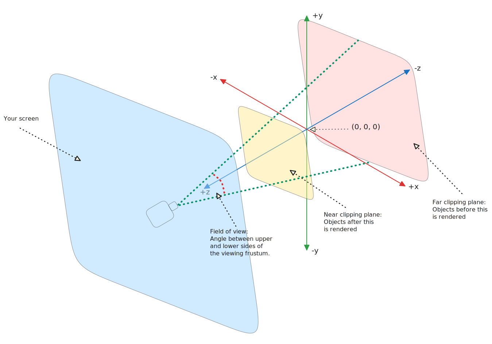
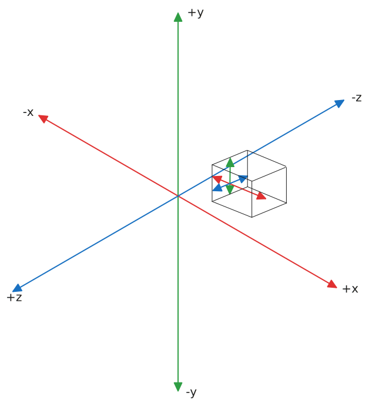

# Co-ordinate system

## World Space
Scenes defines a "world" space co-ordinate system depicted in the graph below. Objects added to a scene will move relative to said world space.

## Local/Object space
Objects have their own space. What does this mean? In essenence, whenever an object is created its vertices are defined relative to its own centre not the world.

### References
- [Coordinate Systems: World Space and Local Space](https://discoverthreejs.com/book/first-steps/transformations/#coordinate-systems-world-space-and-local-space)

# Orinetation decision
For intuitive 2D map co-ordinates, this project uses the XY plane for the map surface

## Rationale
Map co-ordinates are naturally expressed as (X, Y) positions

