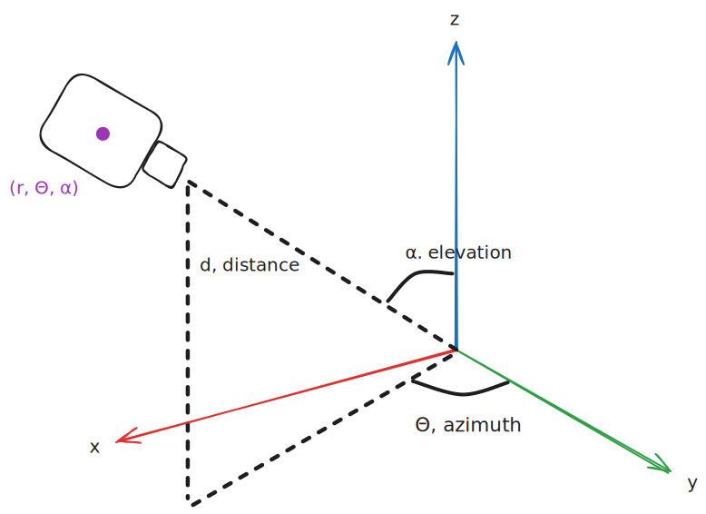

# Spherical Coordinate System

Spherical coordinates define a point using one distance (radius) and two angles (azimuth and elevation) from an origin.

This system allows us to describe any point on the surface of a sphere, making it extremely useful for orbital mechanics and camera rotation systems


## Use in Camera Rotation

When rotating a camera, there's typically an anchor or focal point (the "lookAt" target) that the camera orbits around.

During rotation:
- We adjust the **azimuth** (horizontal angle) and **elevation** (vertical angle)
- The **radius** (distance from camera to anchor) stays constant
- Using these spherical coordinates, we can calculate the camera's new position
- We then convert back to Cartesian coordinates to update the camera's position in 3D space

## Coordinate Definitions

- **r (radius)**: Distance from the origin to the point
- **θ (theta/azimuth)**: Horizontal angle around the Y-axis (rotation left/right)
- **φ (phi/elevation)**: Vertical angle from the horizontal plane (rotation up/down)

## Converting from Spherical to Cartesian
```
x = r × sin(azimuth) × cos(elevation)
y = r × sin(elevation)
z = r × cos(azimuth) × cos(elevation)
```

## Converting from Cartesian to Spherical
Where (x, y, z) is the distance to an origin
```
r = √(x² + y² + z²)
azimuth = atan2(x, z)
elevation = asin(y / r)
```

### > [!NOTE]
> These formulas assume the origin is set at (0, 0, 0), if the origin is at (cx, cy, cz) it can be adjusted by adding or subtracting cx, cy, and cz to the respective coordinates 

[Spherical coordinate system](https://en.wikipedia.org/wiki/Spherical_coordinate_system)

